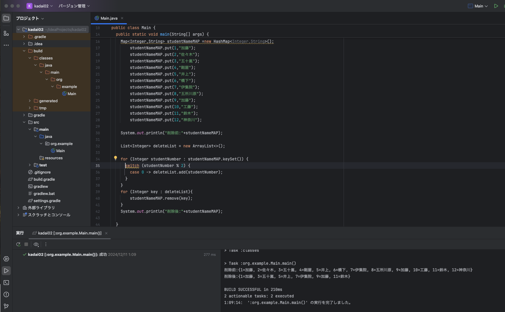

# 06_繰り返し処理_配列_ListとMap_switch式 課題提出  

  
## ・課題1
* 条件   
生徒名みたいな文字列のリストを作って下さい。   
リストの数は10個以上。   
リストに入ってる文字数が３文字以上のものを表示する。   
このリストをループさせて繰り返し処理を実装し,    
その中で上記条件を満たすものだけを表示する。  
<br>
  

* 回答コード↓
```java

import java.util.ArrayList;
import java.util.List;


public class Main {

  public static void main(String[] args) {

    List<String> studentNameList = List.of("小林","佐々木","五十嵐","井上","橋下","伊集院",
        "五所川原","加藤","工藤", "鈴木","剛屋","遠藤");

    System.out.println(studentNameList);

    for (String mojisuu : studentNameList){
      if (mojisuu.length() >= 3) {
        System.out.println(mojisuu);
      }
    }
  }
}

```
*実行結果スクリーンショット↓
  

## ・課題2
Mapを作って下さい。生徒名と番号にの組み合わせ。例(1,”江並”)  
Mapの要素は10個以上。  
Mapの番号が偶数のものをMapから削除する。  
上記の処理を行う繰り返し処理を実装して下さい。  
<br>


* 回答コード↓
```java
package org.example;
import java.util.ArrayList;
import java.util.HashMap;
import java.util.List;
import java.util.Map;

//TIP コードを<b>実行</b>するには、<shortcut actionId="Run"/> を押すか
// ガターの <icon src="AllIcons.Actions.Execute"/> アイコンをクリックします。
public class Main {

  public static void main(String[] args) {

    List<String> studentNameList = List.of("小林","佐々木","五十嵐","井上","橋下","伊集院",
        "五所川原","加藤","工藤", "鈴木","剛屋","遠藤");

    System.out.println(studentNameList);


    for (String mojisuu : studentNameList){
      if (mojisuu.length() >= 3) {
        System.out.println(mojisuu);
      }
    }

    Map<Integer,String> studentNameMAP =new HashMap<Integer,String>();
        studentNameMAP.put(1,"加藤");
        studentNameMAP.put(2,"佐々木");
        studentNameMAP.put(3,"五十嵐");
        studentNameMAP.put(4,"剛屋");
        studentNameMAP.put(5,"井上");
        studentNameMAP.put(6,"橋下");
        studentNameMAP.put(7,"伊集院");
        studentNameMAP.put(8,"五所川原");
        studentNameMAP.put(9,"加藤");
        studentNameMAP.put(10,"工藤");
        studentNameMAP.put(11,"鈴木");
        studentNameMAP.put(12,"神奈川");

    System.out.println("削除前:"+studentNameMAP);

    List<Integer> deleteList = new ArrayList<>();

    for (Integer studentNumber : studentNameMAP.keySet()) {
      if (studentNumber % 2 == 0) {
        deleteList.add(studentNumber);
      }
    }
    for (Integer key : deleteList){
        studentNameMAP.remove(key);
    }
    System.out.println("削除後:"+studentNameMAP);
  }
}


```

* 実行結果スクリーンショット↓


ここで動画のタイトルが「Map_switch式」と書かれていることに気がつきました。  

IDEの提案でfor文を変換したスクリーンショットも載せます。



## ・課題を終えての感想  
課題１では、プログラムとは関係ないものの、  
リストの中身を書く時に、"半角英数とかな"の変換が多く、タイプミスやスピードの遅さが気になり、  
何かいい方法がないか調べました。  
結論としては、タイピング練習をするしかないなと思いました。

課題２では、動画内でMap.of が紹介されていた為、まずは真似て書いて見ようと思いました。  
すると11個目を書いているとうまく認識されず、調べると11個以上のものはMap.ofEntriesを使うとのことでした。  
そこでMap.ofEntriesについて調べていると、MapはHashMapの情報ばかりが出てきました。  
新しいから情報が少ないのかとJava SE 9 & JDK 9の公式情報を読みました。  
<Map.of()およびMap.ofEntries（静的ファクトリ・メソッドは、不変のマップを作成する便利な方法を提供します。
・彼らは「構造的に不変な」です。キーと値を追加、削除、または更新することはできません。>

とのことでした。削除を必要とする今回の課題には適さないと結論を出し、HashMapを使うことにしました。  
お恥ずかしながら、今までの学習ではchatGPTや一般の方がまとめた噛み砕いた言い回しの物しか理解できなかったのですが、  
今回公式情報から自分の結論が出せたことが嬉しかったです。
公式情報を読むことは実務で必須だとおもいますので、苦手意識を薄くしていきたいと思います。